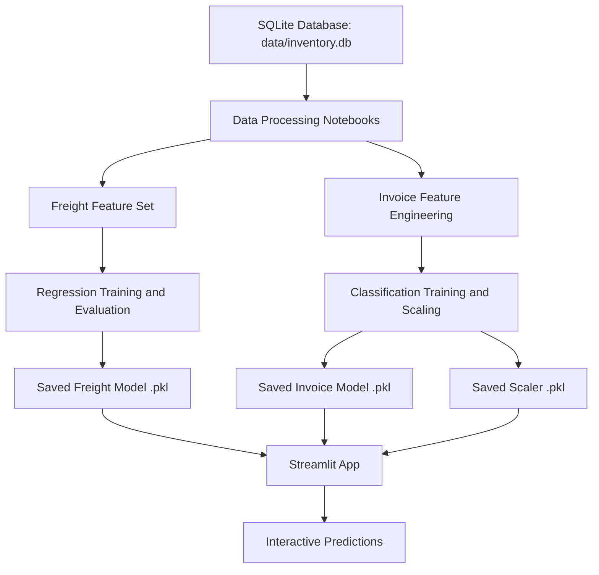

# 🧾 Vendor Invoice Intelligence Portal

🚀 **Live App:** [https://vendor-invoice-intelligence-app-77gt8jg95btahv93my4z2s.streamlit.app/](https://vendor-invoice-intelligence-app-77gt8jg95btahv93my4z2s.streamlit.app/)

A machine learning project for vendor invoice analytics with two business outcomes:

1. 🚚 Freight cost prediction for incoming invoices.
2. 🚩 Invoice manual-review flag prediction for risky or anomalous invoices.

The project combines data extraction from SQLite, notebook-based experimentation, saved model artifacts, and a Streamlit application for interactive inference.

## 🎯 Project Goals

This project is designed to help procurement and finance teams:

- 📦 estimate freight cost before final review,
- 🔍 identify invoices that may require manual validation,
- ⚡ reduce review time for low-risk invoices,
- 📊 support data-driven invoice operations.

## 💡 Solution Overview

The solution has two parallel ML workflows.

### 1. 🚚 Freight Cost Prediction

This workflow predicts the freight amount using invoice-level numeric features.

- Problem type: Regression
- Main features: `Quantity`, `Dollars`
- Target: `Freight`
- Candidate models:
  - Linear Regression
  - Decision Tree Regressor
  - Random Forest Regressor
- Model selection rule: lowest MAE on test data

### 2. 🚩 Invoice Manual Approval Flagging

This workflow predicts whether an invoice should be flagged for manual review.

- Problem type: Binary Classification
- Engineered features:
  - `invoice_quantity`
  - `invoice_dollars`
  - `invoice_freight`
  - `total_brands`
  - `total_item_quantity`
  - `days_po_to_invoice`
  - `total_item_dollars`
- Target: `flag_invoice`
- Classifier: Random Forest Classifier with `GridSearchCV`
- Preprocessing: `StandardScaler`
- Optimization metric: F1 score

## 🏗️ Architecture



## 🔄 End-to-End Workflow

### 🗄️ Data Layer

The project uses a SQLite database:

- `data/inventory.db`

This database is the main structured source used by both model pipelines.

### 🚚 Freight Pipeline

The freight workflow is organized as:

- `frieght_cost_prediction/data_proccesing.ipynb`
  - loads `vendor_invoice` data from SQLite,
  - selects `Quantity` and `Dollars` as input features,
  - uses `Freight` as the target.
- `frieght_cost_prediction/Model_evaluation.ipynb`
  - defines training functions for regression models,
  - evaluates models using MAE, RMSE, and R2.
- `frieght_cost_prediction/train.ipynb`
  - trains multiple regression models,
  - compares results,
  - saves the best model.

Saved freight artifacts:

- `frieght_cost_prediction/models/predict_freight_model.pkl`
- `frieght_cost_prediction/models/freight_model.pkl`

The current Streamlit app loads `freight_model.pkl`.

### 🚩 Invoice Flagging Pipeline

The invoice flagging workflow is organized as:

- `invoice_flagging/data_preprocssing.ipynb`
  - loads invoice and purchase data from SQLite,
  - builds engineered invoice-level features,
  - creates the binary label `flag_invoice`,
  - splits the data,
  - scales the features.
- `invoice_flagging/modeling.ipynb`
  - defines a `RandomForestClassifier`,
  - performs hyperparameter tuning with `GridSearchCV`,
  - uses F1 score as the selection metric,
  - evaluates the classifier with accuracy and classification report.
- `invoice_flagging/train.ipynb`
  - executes preprocessing,
  - trains the tuned classifier,
  - saves the trained model and scaler.

Saved invoice artifacts:

- `invoice_flagging/models/predict_flag_invoice.pkl`
- `invoice_flagging/models/scaler.pkl`

### 🔮 Inference Layer

Notebook-based inference is available in:

- `inference/predict_frieght.ipynb`
- `inference/predict_invoiceFlagg.ipynb`

These notebooks show how to load saved artifacts and generate predictions for new input data.

### 🖥️ Application Layer

The interactive UI is implemented in:

- `app.py`

The Streamlit app:

- loads the saved model artifacts,
- lets the user select a prediction module,
- collects input values through forms,
- returns freight cost predictions,
- returns invoice manual-review predictions.

## 📁 Current Project Structure

```text
 Invoice Intelligence System/
├── app.py
├── README.md
├── data/
│   └── inventory.db
├── code/
│   ├── invoice_flagging.ipynb
│   └── predicting_frieghtCost.ipynb
├── frieght_cost_prediction/
│   ├── data_proccesing.ipynb
│   ├── Model_evaluation.ipynb
│   ├── train.ipynb
│   └── models/
│       ├── freight_model.pkl
│       └── predict_freight_model.pkl
├── inference/
│   ├── predict_frieght.ipynb
│   └── predict_invoiceFlagg.ipynb
└── invoice_flagging/
    ├── data_preprocssing.ipynb
    ├── modeling.ipynb
    ├── train.ipynb
    └── models/
        ├── predict_flag_invoice.pkl
        └── scaler.pkl
```

## 🧠 Model Development Process

## 🚚 Freight Model Process

1. Load vendor invoice records from SQLite.
2. Select `Quantity` and `Dollars` as predictors.
3. Split data into train and test sets.
4. Train three regression models:
   - Linear Regression
   - Decision Tree Regressor
   - Random Forest Regressor
5. Evaluate each model using:
   - MAE
   - RMSE
   - R2
6. Save the best model based on lowest MAE.

## 🚩 Invoice Flagging Model Process

1. Load invoice and purchase data from SQLite.
2. Aggregate purchase-level metrics by `PONumber`.
3. Engineer invoice-level explanatory features.
4. Create the `flag_invoice` label using business rules:
   - invoice amount mismatch threshold,
   - receiving delay threshold.
5. Split the dataset using stratification.
6. Scale features with `StandardScaler`.
7. Train `RandomForestClassifier` with hyperparameter tuning.
8. Evaluate using:
   - Accuracy
   - Classification Report
   - F1-oriented model selection via `GridSearchCV`
9. Save the classifier and scaler.

## 📋 Key Business Rules Used for Flagging

The binary target `flag_invoice` is created from business logic in preprocessing.

An invoice is flagged when either condition is met:

- absolute difference between `invoice_dollars` and `total_item_dollars` is greater than 5,
- `avg_receiving_delay` is greater than 10.

This means the classification model is learning a label derived from operational rules rather than a manually curated historical label.

## 📦 Dependencies

Core Python dependencies used in the project:

- 🌐 `streamlit`
- 🐼 `pandas`
- 💾 `joblib`
- 🤖 `scikit-learn`
- 🔢 `numpy`
- 🗄️ `sqlite3` (standard library)
- 📂 `pathlib` (standard library)

Suggested installation command:

```powershell
pip install streamlit pandas joblib scikit-learn numpy
```

If you use the workspace virtual environment:

```powershell
& "d:/Data Anayst codes/venv/Scripts/python.exe" -m pip install streamlit pandas joblib scikit-learn numpy
```

## ▶️ How to Run the Streamlit App

From the workspace root:

```powershell
& "d:/Data Anayst codes/venv/Scripts/python.exe" -m streamlit run ML_project/app.py
```

Then open:

```text
http://localhost:8501
```

## 🔁 How to Retrain the Models

Because the training workflow is notebook-based, retraining is typically done by executing the notebooks in order.

### Freight Retraining Order

1. `frieght_cost_prediction/data_proccesing.ipynb`
2. `frieght_cost_prediction/Model_evaluation.ipynb`
3. `frieght_cost_prediction/train.ipynb`

### Invoice Flagging Retraining Order

1. `invoice_flagging/data_preprocssing.ipynb`
2. `invoice_flagging/modeling.ipynb`
3. `invoice_flagging/train.ipynb`

## 📥 Input Requirements

### 🚚 Freight Prediction Inputs

The app expects:

- `Quantity`
- `Dollars`

### 🚩 Invoice Flag Prediction Inputs

The app expects:

- `invoice_quantity`
- `invoice_dollars`
- `invoice_freight`
- `total_brands`
- `total_item_quantity`
- `days_po_to_invoice`
- `total_item_dollars`

## 📤 Outputs

### 🚚 Freight Module

Returns:

- 💵 predicted freight cost as a numeric amount.

### 🚩 Invoice Flagging Module

Returns:

- ✅ `0` for auto-approve,
- ⚠️ `1` for manual review required.

## 🔧 Technical Notes

- Several folders and notebook names contain spelling inconsistencies such as `frieght`, `preprocssing`, and `Flagg`. The README preserves the existing names so they match the actual repository.
- The project is currently notebook-driven for data science workflows and script-driven for the Streamlit application.
- The Streamlit app is the main deployment interface for end users.

## ⚠️ Limitations

- Training logic is distributed across notebooks rather than Python modules.
- There is no pinned `requirements.txt` file yet.
- Model versioning and experiment tracking are not currently formalized.
- Input validation in the app is minimal and numeric-only.

## 🚀 Recommended Next Improvements

1. Add a `requirements.txt` or `pyproject.toml` for reproducible setup.
2. Refactor notebook logic into reusable Python modules.
3. Add batch prediction support for CSV uploads in the Streamlit app.
4. Add model performance snapshots and sample outputs to the README.
5. Add tests for inference functions and artifact loading.

## ✍️ Authoring Intent

This repository reflects a practical machine learning workflow moving from notebook experimentation to an interactive application for business users. It is best understood as a portfolio-style applied ML project with an operational dashboard layer.
